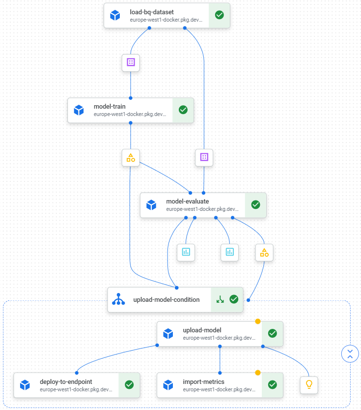

# Description.
This is a test project that implements ML model deployment using GCP Vertex AI Pipelines. Its data and model are based on the Kaggle competition https://www.kaggle.com/competitions/home-credit-credit-risk-model-stability/ in which I participated.

## Key features:
* ML model is based on sklearn pipeline and custom preprocessing classes.
* Custom docker images are used for prediction and training stages (allows to import additional dependencies).
* Data is imported into multiple BigQuery tables.

